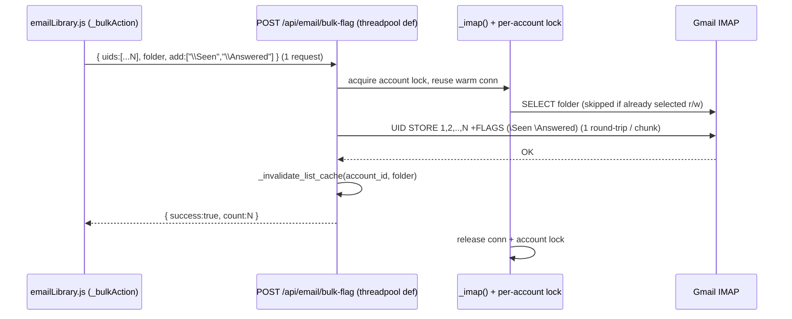

# Email Operations Performance — Design Spec

**Date:** 2026-06-19
**Status:** Draft for review
**Component:** `routes/email_routes.py`, `routes/email_helpers.py`, `static/js/emailInbox.js`, `static/js/emailLibrary.js`

## Goal

Make interactive email operations — marking read / answered / done, switching
between messages, bulk-marking, and searching — feel instant instead of taking
seconds-to-minutes. The slowness is fully diagnosed (below); this spec covers
the agreed fix set only.

## Problem / Root Cause

Diagnosed live on `hetzner-1` (deployed image `odysseus-fork:fixes`; container
files sha256-match the local `fixes` branch, so local code is authoritative).
Backend IMAP is remote `imap.gmail.com:993`; the default mailbox INBOX holds
~140k messages, so every server round-trip is expensive (measured: connect+login
~450ms, `SELECT INBOX` ~450ms, STORE ~150ms; `SELECT` balloons to 1.5–6.3s under
Gmail throttling).

Four compounding causes:

1. **Event-loop blocking (primary).** Ten mutation handlers in
   `routes/email_routes.py` are declared `async def` but execute synchronous,
   blocking `imaplib` calls (`conn.select`, `conn.uid("STORE"/"COPY"/"MOVE")`,
   `conn.expunge`) with no `await`. In FastAPI an `async def` runs on the single
   event-loop thread, so each blocking call freezes the **entire app** until the
   IMAP round-trip returns, and the requests execute strictly serially. The heavy
   read paths (`/list`, `/read/{uid}`, `/search`, `/archive`) were already moved
   off-loop; these small mutation handlers were missed.

   Affected handlers (line numbers approximate, current `fixes` tip):
   `mark_unread` (1752), `flag_email` (1766), `mark_read` (1782),
   `delete_email` (1812), `delete_email_permanent` (1826),
   `delete_odysseus_reminder_emails` (1841), `move_email` (1916),
   `list_folders` (1930), `mark_answered` (1948), `clear_answered` (1961).

2. **Two requests per email + client-side fan-out.** The UI's "mark done" fires
   `POST /mark-answered` **and** `POST /mark-read` per email
   (`emailInbox.js:1111-1112`; `emailLibrary.js:2968-2969, 5577-5578, 5770-5771,
   6045-6046`). The library bulk action (`_bulkAction`, `emailLibrary.js:~6000`)
   loops over selected UIDs with a client-side concurrency pool (`CONCURRENCY = 6`).
   So bulk-marking N emails issues **2N** requests, up to 6 in flight. Today the
   server's event-loop blocking serializes them anyway; once handlers are threaded
   (fix 1), those 6 concurrent requests would each grab the single pooled IMAP
   connection (cause 3), opening a fresh-connect storm and leaking handles.

3. **Single-connection pool with no folder-state tracking.** `_IMAP_POOL`
   (`email_routes.py:525`, keyed `(account_id, owner)`, guarded by `_pool_lock`,
   wired into the `_imap()` context manager via `_POOL_HOOKS`) holds at most one
   connection per account and does not remember which folder is selected, so every
   handler re-issues `conn.select(folder)` (~450ms) even when the pooled connection
   already has that folder selected — ~4× the actual STORE cost wasted per op.
   `_pooled_connect` pops the connection out and `_pooled_release` overwrites the
   slot, so concurrent callers spawn fresh connections that are dropped without
   `logout()` (a latent leak, masked today by the async serialization).

4. **Search crashes on non-ASCII (correctness).** `search_emails`
   (`email_routes.py:1099`) builds a `str` criteria and passes it to
   `conn.uid("SEARCH", None, criteria)`; imaplib ASCII-encodes command arguments,
   so any accented query raises `UnicodeEncodeError`. Logged in production:
   `ERROR - Search failed: 'ascii' codec can't encode character '\xe1'` (`á`).

## Scope

**In scope (this spec):** fixes 1, 2, 3, 4 — corresponding to the approved picks
A1, B1, C1, #5.

**Out of scope (noted, not implemented here):**
- A full bounded **multi-connection** pool per account (would allow true
  server-side concurrency for one account). C1 instead serializes pooled ops per
  account, which is correct and leak-free; the bulk endpoint removes the need for
  many concurrent mark requests.
- Bulk `archive` / `delete` / `move` endpoints. Those keep their per-UID client
  loops; fix 1 + C1 make them safe and non-freezing (they serialize on the
  per-account lock).
- Raising read-prefetch breadth (`_WARM_READ_LIMIT`).
- IMAP `TEXT` search latency over Gmail's 140k-message All Mail (inherent; not a
  regression).

## Design

### A1 — Move the 10 mutation handlers off the event loop

Drop the `async` keyword from each of the ten handlers, turning them into plain
`def`. FastAPI then runs them in its threadpool, keeping the event loop
responsive. The handler bodies contain no `await`, so this is a keyword-only
change plus the one-line marker comment already used on `archive_email`:

```python
# Sync def: blocking IMAP I/O with no awaits — runs in a threadpool instead of
# blocking the event loop. See search_emails / archive_email.
```

`delete_odysseus_reminder_emails` performs several IMAP ops in a loop — still
just `def`; no further change to its body.

### C1 — Per-account serialization + selected-folder cache

This is required to make A1 safe (cause 2/3 interaction) and delivers fix 3.

**Per-account lock.** Add a registry of per-key locks
(`_pool_key_locks: dict[(account_id, owner), threading.Lock]`, created under the
existing `_pool_lock`). The `_imap()` context manager acquires the key's lock
before connecting and releases it after releasing the connection, so all pooled
operations for one account serialize on a single reused connection; different
accounts proceed independently. The lock is held across the `with` body (across
the generator `yield`). On a connect failure the lock MUST be released before the
exception propagates (today `_imap()` calls `_pooled_release` only in a `finally`
reached after a successful connect, so the acquire/release of the key lock is
moved into `_pooled_connect`/`_pooled_release`, and `_pooled_connect` releases its
own lock if `_imap_connect` raises).

**Selected-folder cache.** Track the current selection on the connection object as
an attribute, e.g. `conn._odys_sel = (folder, readonly)`. Introduce a helper:

```python
def _imap_select(conn, folder, readonly=False):
    want = (folder, bool(readonly))
    if getattr(conn, "_odys_sel", None) == want:
        return "OK"
    status, _ = conn.select(_q(folder), readonly=readonly)
    conn._odys_sel = want if status == "OK" else None
    return status
```

Replace the direct `conn.select(_q(folder))` calls in the pooled handlers
(mutations: `readonly=False`; `search_emails`: `readonly=True`) with
`_imap_select(...)`. The `(folder, readonly)` key is required because a readonly
`SELECT` left by a search must be re-issued read-write before a STORE. `STORE`,
`MOVE`, `COPY`, and `EXPUNGE` do not change the selected folder, so the cache stays
valid across them. A fresh or reconnected connection has no `_odys_sel`, so the
first select always runs. (`_list_emails_sync` / `_read_email_sync` open their own
fresh connections via `_imap_connect` and are unaffected.)

### B1 — `POST /api/email/bulk-flag` endpoint

A single generic endpoint collapses every multi-request flag path into one
batched IMAP `UID STORE`.

**Request**

```
POST /api/email/bulk-flag?account_id=<id>
{
  "uids":   ["379934", "378488", ...],   // required, non-empty
  "folder": "INBOX",                       // default "INBOX"
  "add":    ["\\Seen", "\\Answered"],     // flags to set   (optional)
  "remove": ["\\Answered"]                  // flags to clear (optional)
}
```

**Validation (400 on failure):**
- `uids` non-empty; **every** UID matches `^\d+$` (they are concatenated into an
  IMAP sequence set, so non-numeric input is rejected to prevent command
  injection).
- `add`/`remove` flags restricted to an allowlist: `\Seen`, `\Answered`,
  `\Flagged`. (`\Deleted` is deliberately excluded so this endpoint cannot
  mass-delete.) At least one of `add`/`remove` must be present.
- Owner scoping: `require_owner` dependency + `_assert_owns_account(account_id, owner)`
  when `account_id` is given — identical to the other handlers.

**Handler (plain `def`, threadpool):**

```python
_BULK_STORE_CHUNK = 500  # bound IMAP command-line length

with _imap(account_id, owner=owner) as conn:
    _imap_select(conn, folder, readonly=False)
    for chunk in _chunk(uids, _BULK_STORE_CHUNK):
        seqset = ",".join(chunk).encode()
        if add:
            conn.uid("STORE", seqset, "+FLAGS", "(" + " ".join(add) + ")")
        if remove:
            conn.uid("STORE", seqset, "-FLAGS", "(" + " ".join(remove) + ")")
_invalidate_list_cache(account_id, folder)
return {"success": True, "count": len(uids), "folder": folder}
```

IMAP `UID STORE` accepts a sequence set and a parenthesized flag list natively, so
N emails become one round-trip per chunk per add/remove group (typically a single
STORE for a normal selection). Missing UIDs are silently ignored by STORE, so the
endpoint is effectively idempotent and needs no per-UID existence probe. On a
non-OK STORE status, return `{"success": False, "error": "Mail operation failed"}`.

### #5 — Fix accented search

In `search_emails`, encode the criteria as UTF-8 bytes and pass the charset:

```python
status, data = conn.uid("SEARCH", "CHARSET", "UTF-8", search_cmd.encode("utf-8"))
```

Apply this **only at the `search_emails` call site** (`email_routes.py:1145`),
replacing `_imap_uid_search(conn, search_cmd)`. Leave the shared
`_imap_uid_search` helper and its `_list_emails_sync` filter callers unchanged —
their criteria are always ASCII (IMAP filter keywords, email addresses,
Message-IDs), so they neither need nor should force a charset. ASCII queries are
unaffected because UTF-8 is an ASCII superset.

### Frontend changes

Route the **2-request "done"** paths and the **bulk loop's flag actions** through
`bulk-flag`; leave the already-single-request endpoints (`mark-read` on open,
`mark-unread`, `clear-answered`, `flag`) untouched.

- `emailInbox.js` (~1110-1115): "done" → one `POST /api/email/bulk-flag`
  `{uids:[uid], folder, add:["\\Seen","\\Answered"]}`; "un-done" stays
  `clear-answered` (already one request) **or** `bulk-flag` `{remove:["\\Answered"]}`
  for symmetry (implementer's choice — keep the existing `clear-answered` to
  minimize churn).
- `emailLibrary.js` `_bulkAction` (~6000): for actions `done` / `read` / `unread`,
  send **one** `bulk-flag` request with all selected `uids`
  (`done`→`add:["\\Seen","\\Answered"]`, `read`→`add:["\\Seen"]`,
  `unread`→`remove:["\\Seen"]`) instead of the per-UID `CONCURRENCY=6` loop.
  `archive` / `delete` keep the existing loop.
- `emailLibrary.js` single-message "done" toggles (2968-2969, 5577-5578,
  5770-5771, 6045-6046): replace the 2-fetch sequence with one `bulk-flag`
  `{uids:[uid], add:["\\Seen","\\Answered"]}`.
- Preserve existing optimistic-UI + revert-on-failure and
  `_syncEmailReadState` / cache-writeback behavior; just change the network call.

## Data Flow (bulk "mark done" of N emails)



Before: `2N` requests, each `async`-blocking the loop, each a full
`SELECT`+`STORE`. After: 1 request, off-loop, one (cached) `SELECT` + one batched
`STORE`.

## Error Handling

- New endpoint mirrors existing handlers: caught exceptions log server-side and
  return `{"success": False, "error": "Mail operation failed"}` (no internals
  leaked); validation failures return HTTP 400.
- Per-account lock released on every path including connect failure (no deadlock).
- Folder-cache invalidated to `None` when a `SELECT` returns non-OK, so a failed
  selection never leaves a stale cache that skips a needed re-select.
- Frontend reverts optimistic state and surfaces the existing error toast when
  `bulk-flag` responds non-OK / `success:false`.

## Security

- UID allowlist (`^\d+$`) and flag allowlist (`\Seen`/`\Answered`/`\Flagged`)
  prevent IMAP command injection and bound the endpoint's blast radius (no
  `\Deleted`).
- Owner scoping via `require_owner` + `_assert_owns_account`, identical to peers;
  pool key remains `(account_id, owner)` so per-user connection isolation is
  preserved.

## Testing / Verification

Backend tests follow the existing convention (`pytest`, FastAPI `TestClient`,
stubbed IMAP connection via `monkeypatch` on `_POOL_HOOKS` / `_imap_connect`, as in
`tests/test_imap_leak_fixes.py` and `tests/test_email_gmail_fetch_flags.py`). New
file: `tests/test_email_bulk_flag.py` (plus additions to existing files where
noted).

1. **Handlers are sync** — `inspect.iscoroutinefunction(...)` is `False` for all
   ten mutation handlers (regression guard against reintroducing async-blocking).
2. **Bulk STORE batching** — `bulk-flag` with 3 UIDs + `add:["\\Seen","\\Answered"]`
   issues exactly one `conn.uid("STORE", b"1,2,3", "+FLAGS", "(\\Seen \\Answered)")`.
3. **Add + remove** — both groups present → one `+FLAGS` STORE and one `-FLAGS`
   STORE.
4. **Chunking** — `> _BULK_STORE_CHUNK` UIDs → `ceil(N/chunk)` STOREs.
5. **Validation** — non-numeric UID → 400; flag outside allowlist (incl.
   `\Deleted`) → 400; empty `uids` → 400; empty add+remove → 400.
6. **Cache invalidation** — `_invalidate_list_cache` called after a successful
   bulk-flag.
7. **Selected-folder skip** — two pooled ops, same folder + mode → `conn.select`
   called once.
8. **Mode change re-selects** — readonly select then read-write op on the same
   folder → `conn.select` called twice.
9. **Per-account serialization** — concurrent `_imap()` uses for the same key open
   only one connection (`_imap_connect` called once); two different keys are
   independent.
10. **Lock released on connect failure** — `_imap_connect` raising does not leave
    the key lock held (a subsequent `_imap()` for the same key does not deadlock).
11. **Search UTF-8** — query `"árvíz"` calls
    `conn.uid("SEARCH", "CHARSET", "UTF-8", <utf-8 bytes>)` and raises no
    `UnicodeEncodeError`; ASCII query still returns results.

Frontend (`tests/test_email_library_bulk_actions.py`, which asserts on the
`_bulkAction` JS source): update the existing assertions so bulk read/unread/done
assert a single `bulk-flag` request carrying all UIDs, while preserving the
existing invariants — writes persist to the provider (not UI-only), backend
`success` is checked before syncing cache, and `_libCacheWriteBack()` runs.

## Risks

- **Threading exposes the latent pool leak** if C1 is not landed together with A1.
  Mitigation: A1, C1 ship as one change; test 9/10 cover it.
- **Folder-cache staleness** if any pooled path mutates the selected folder without
  updating `_odys_sel`. Mitigation: only `_imap_select` writes the attribute; STORE
  /MOVE/COPY/EXPUNGE provably don't change selection; tests 7/8 guard it.
- **Gmail flag semantics** — `\Answered`/`\Flagged` are standard system flags Gmail
  honors on All Mail/INBOX; batched STORE over a UID set is standard IMAP.

## Affected Files

**Modified**
- `routes/email_routes.py` — `async`→`def` on ten handlers; `_imap_select` helper;
  per-account lock in `_pooled_connect`/`_pooled_release`; `_odys_sel` tracking;
  new `bulk_flag` endpoint; UTF-8 charset in `search_emails`.
- `routes/email_helpers.py` — `_imap()` context manager: move key-lock
  acquire/release into the pool hooks and ensure release on connect failure.
- `static/js/emailInbox.js` — "done" toggle → `bulk-flag`.
- `static/js/emailLibrary.js` — `_bulkAction` flag actions + single "done" toggles
  → `bulk-flag`.

**New**
- `tests/test_email_bulk_flag.py`

**Updated tests**
- `tests/test_email_library_bulk_actions.py`
